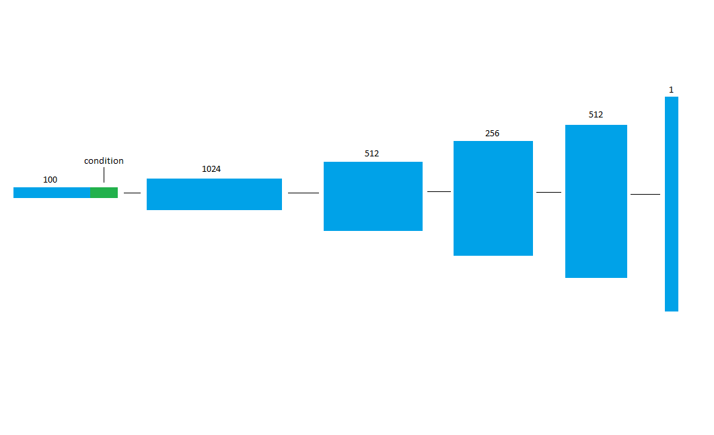
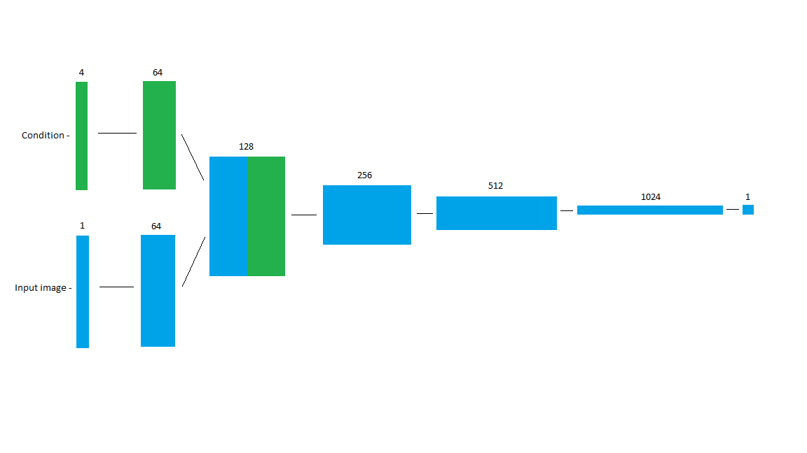
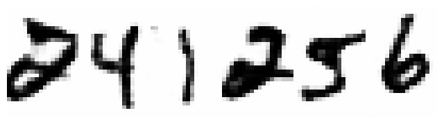

# Handwritten-Number-Generator
This program is based off GANs, specifically the DCGAN with my own addition of a condition which I will explain below. The fundamental idea is that two deep neural network models play a minimax game. The Generator tries to trick the Discriminator into classifying the Generated data as real while the Discriminator tries to classify fake data as fake and real data as real. Hence the 'Adversarial' in GAN. The DCGAN uses deep convolutional layers while omitting all feed-forward layers. This specific variant of DCGAN uses condition as well as weight clipping as a quick way of enforcing lipchitz constraint (although gradient penatly is more effective. Refer to my WGAN repo for more info).

The Generator consists of a sequence of strided transposed convolutions (sometimes referred to as deconvolutions) which gradually expand the feature space until the final output where the feature space is downsized to the desired channel size (1 for mnist). Output function is tanh.

Reference to DCGAN paper: https://arxiv.org/pdf/1511.06434.pdf



The Discriminator takes an input as image and outputs a classification score using sigmoid. A series of strided convolutions are applied to the input image to downsize until it a 1 dimensional tensor which is used as the classifcation score. Strided convolutions are preferred over poolings due to the convolutions being learnable functions, shown to produce better images.



## Training

Python Files
  - models.py
    - Contains the model architectures described in the DCGAN paper with the addition of my own condition architecture change.
  
    
  - train.py
    - This file is an executable script which trains the GAN model and saves the generator and discriminator to a specified directory every epoch. It also saves sample images of the generator's performance every epoch to a specified directory. Run this file as follows:
    ```
    python train.py --hyperparameters
    ```
    --hyperparameters are a list of hyperparameters to call in order to properly execute train.py. Each hyperparamter is to be entered in this format:
    ```
    --image_directory data/images/
    ```
    followed by a space to seperate each hyperparameter entered. Please refer to **script_run.ipynb** Jupyter Notebook file to see specific hyperparamters
    
  - generate_number.py
    - An executable file that takes in a few parameters (please refer to file for more info) and saves an image of the generated number to a specified file.
    Here is an example of a run
    ```
    python generate_number.py --number 241256
    ```
    

## Dataset

The dataset being used here is MNIST. The MNIST dataset contains large diversity of handwritten numbers for machine learning and deep learning purposes.

## Results
